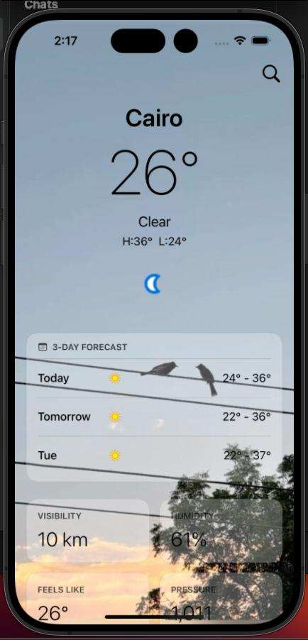
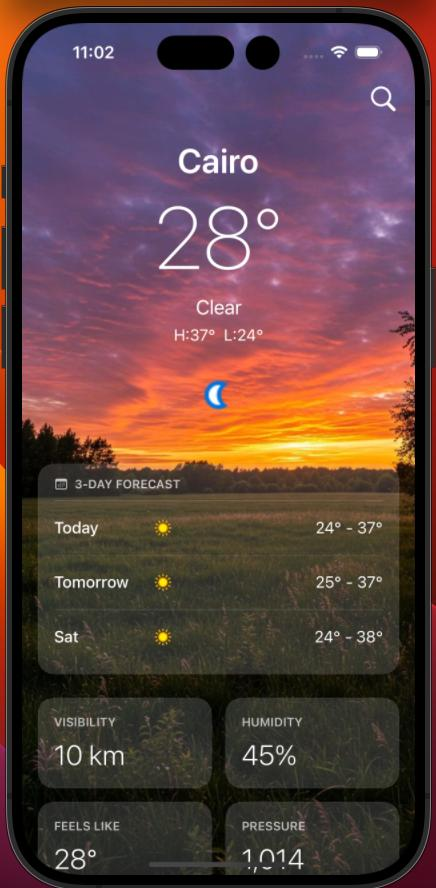
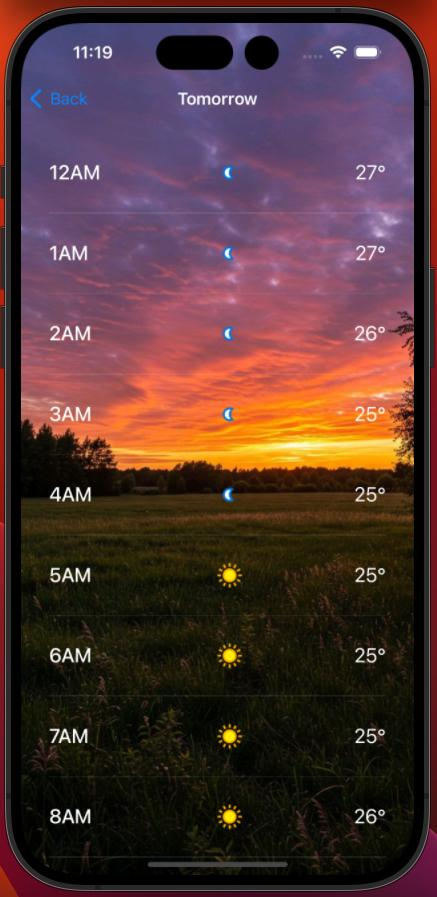
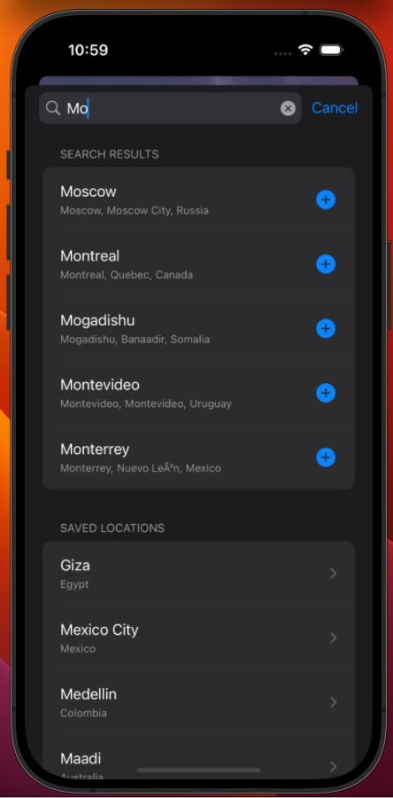

# WeatherCast 🌤️

A native iOS weather application built with SwiftUI as part of the **JET (Java Education and Technology Services) — ITI Professional 9-Month Diploma in Mobile Applications Development**.

---

## Screenshots

| Morning Theme | Evening Theme | Hourly Forecast | Saved Locations | | Video Demo |
|  |  |  |  |  |
---

## Features

- **Time-aware theming** — morning background (05:00–17:59) with black text; evening background (18:00–04:59) with white text
- **Screen 1 — Main Weather View**
  - Current location name, temperature, condition text, H/L temperatures, condition icon
  - 3-Day Forecast card (Today / Tomorrow / Day after) — tap any row to drill in
  - Detail grid: Visibility · Humidity · Feels Like · Pressure
- **Screen 2 — Hourly Forecast** — shows hours from now onward for the selected day
- **City Search** — live search powered by WeatherAPI `/search.json`
- **Saved Locations** — pin any city; persisted across launches via SwiftData; swipe-to-delete
- **Offline-graceful caching** — last known weather shown instantly; stale cache served when network is unavailable

---

## Tech Stack

| Concern | Solution |
|---|---|
| UI | SwiftUI |
| Architecture | MVVM |
| Dependency Injection | [Swinject](https://github.com/Swinject/Swinject) |
| Persistence / Cache | SwiftData |
| Networking | `URLSession` + `async/await` |
| Minimum iOS | iOS 17 |

---

## Architecture

```
┌─────────────────────────────────────────────────────────┐
│  Views  (SwiftUI)                                       │
│  WeatherView · HourlyForecastView                       │
│  LocationSearchView · LocationDetailView                │
│           │  @ObservedObject / @StateObject              │
├─────────────────────────────────────────────────────────┤
│  ViewModel  (@MainActor  ObservableObject)              │
│  WeatherViewModel                                       │
│           │  protocol  (injected by Swinject)           │
├─────────────────────────────────────────────────────────┤
│  Repository  (WeatherRepositoryProtocol)                │
│  WeatherRepository                                      │
│     ├── SwiftData cache  (CachedWeather, 30 min TTL)    │
│     └── WeatherServiceProtocol                          │
├─────────────────────────────────────────────────────────┤
│  Service  (WeatherServiceProtocol)                      │
│  WeatherService  ──▶  WeatherAPI.com / URLSession       │
└─────────────────────────────────────────────────────────┘
```

### Swinject scopes

| Type | Scope | Reason |
|---|---|---|
| `WeatherService` | `.container` (singleton) | Single shared URLSession |
| `WeatherRepository` | `.container` (singleton) | Stateless, safe to share |
| `WeatherViewModel` | `.transient` | Each screen owns its instance |

### SwiftData cache strategy

```
load(query:context:)
 ├─ Cache hit  AND  fresh (< 30 min)  →  return cached response immediately
 ├─ Cache miss OR stale               →  fetch from network
 │     ├─ success  →  update cache, return fresh response
 │     └─ failure  +  stale cache  →  return stale data  (offline fallback)
 └─ failure  +  no cache  →  throw  →  UI shows error state
```

---

## Project Structure

```
WeatherCast/
├── WeatherCastApp.swift
├── Models/
│   ├── WeatherModels.swift          # Codable API response structs
│   └── SwiftDataModels.swift        # @Model classes (CachedWeather, SavedLocationModel)
├── Services/
│   ├── WeatherServiceProtocol.swift
│   └── WeatherService.swift         # URLSession networking
├── Repositories/
│   ├── WeatherRepositoryProtocol.swift
│   └── WeatherRepository.swift      # Caching + saved-location logic
├── DI/
│   ├── AppAssembly.swift            # Swinject registrations
│   └── DIContainer.swift            # Shared resolver wrapper
├── ViewModels/
│   └── WeatherViewModel.swift
└── Views/
    ├── WeatherBackground.swift       # Shared gradient / image background
    ├── ContentView.swift             # NavigationStack root
    ├── WeatherView.swift             # Screen 1
    ├── HourlyForecastView.swift      # Screen 2
    ├── LocationSearchView.swift      # Search + saved cities
    ├── LocationDetailView.swift      # Full weather for a saved city
    └── Components/
        ├── TopSectionView.swift      # City · Temp · Condition · H/L · Icon
        ├── ForecastSectionView.swift # 3-Day Forecast card
        └── BottomSectionView.swift   # Visibility · Humidity · Feels Like · Pressure
```

---

## Setup

### 1 · Create the Xcode Project
1. **Xcode → New → iOS App**
2. Product Name: `WeatherCast` · Interface: **SwiftUI** · Language: **Swift**
3. Minimum Deployment Target: **iOS 17**
4. Delete the generated `ContentView.swift`

### 2 · Add Swinject via Swift Package Manager
**File → Add Package Dependencies…**
```
https://github.com/Swinject/Swinject.git
```
Version rule → **Up to Next Major from 2.9.0** · Add to target `WeatherCast`

### 3 · Copy Source Files
Drag the `WeatherCast/` folder into the Xcode navigator → **Copy items if needed** → **Create groups**

### 4 · Add Your API Key
Open `Services/WeatherService.swift` and replace:
```swift
private let apiKey = "YOUR_API_KEY_HERE"
```
Free key available at **[weatherapi.com](https://www.weatherapi.com)** (free tier includes 3-day forecast + search)

### 5 · Add Background Images *(optional)*
In **Assets.xcassets** create two Image Sets:
- `morningBG` — daytime sky photo (displayed 05:00–17:59)
- `eveningBG` — night sky photo (displayed 18:00–04:59)

If omitted, the app falls back to built-in gradient backgrounds automatically.

### 6 · Network Permissions
If you see ATS errors, add to `Info.plist`:
```xml
<key>NSAppTransportSecurity</key>
<dict>
    <key>NSAllowsArbitraryLoads</key>
    <true/>
</dict>
```

---

## API Reference

**Base URL:** `https://api.weatherapi.com/v1`

| Endpoint | Used for |
|---|---|
| `/forecast.json?key=KEY&q=QUERY&days=3&aqi=yes&alerts=no` | Main weather + 3-day forecast |
| `/search.json?key=KEY&q=QUERY` | City search autocomplete |

Query parameter `q` accepts a city name (`Cairo`), coordinates (`30.07,31.25`), or an IP address.

---
